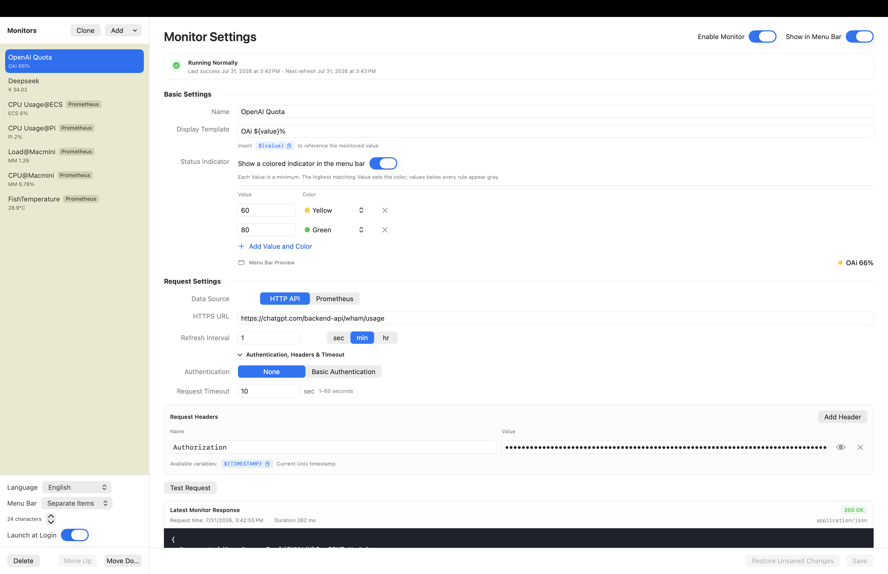

# BarState

BarState 是一个 macOS 15+ 菜单栏工具。它周期性请求用户配置的 HTTPS API，通过简化 JSONPath 或受隔离的完整 JavaScript 函数提取数字，并将选中的监控项显示为可独立拖动的纯文字状态栏项目。

界面支持简体中文和英文。可在 BarState 设置窗口底部选择“跟随系统”“简体中文”或“English”，退出并重新打开应用后生效；选择“跟随系统”时也支持 macOS 的应用语言设置。

## 界面预览

### 状态栏与监控弹窗

<p align="center">
  
</p>

### 设置面板



## 下载与安装

> [!WARNING]
> 当前 Release 提供的是未使用 Apple Developer ID 签名、也未经过 Apple 公证的测试版本。macOS 无法验证其开发者身份或确认文件是否经过篡改。请只从本仓库的 [Releases](../../releases) 页面下载，不要运行第三方重新打包的版本。

当前预发布包要求 macOS 15 或更高版本，并且仅支持 Apple Silicon（M1 或更新的 Mac）。Intel Mac 用户需要暂时从源码自行构建。

1. 在 [Releases](../../releases) 页面下载最新的 `BarState-macos-arm64.dmg`。
2. 打开 DMG，将 `BarState.app` 拖入“应用程序”文件夹。
3. 双击 `BarState.app` 尝试打开。由于当前版本未经签名和公证，macOS 可能会阻止启动。
4. 打开“系统设置” → “隐私与安全性”，滚动到“安全性”区域，找到刚刚被阻止的 BarState，然后点击“仍要打开”。
5. 使用登录密码或 Touch ID 确认，再次点击“打开”。macOS 记住这次选择后，后续可以正常双击启动。

“仍要打开”通常只会在尝试启动应用后的一段时间内出现。不要为安装 BarState 而全局关闭 Gatekeeper。有关这一流程和风险的说明，请参阅 [Apple 官方指南](https://support.apple.com/guide/mac-help/mh40616/mac)。

## 快速开始

1. 启动 BarState，点击菜单栏中的 `BarState`，然后打开设置。
2. 新建监控项，填写名称和一个 `HTTPS` 接口地址。BarState 当前只发送 `GET` 请求。
3. 如果接口需要认证，可以添加 Request Header。请先阅读下方的“隐私与本地数据”说明。
4. 点击“测试请求”，确认接口返回了预期内容。
5. 选择 JSONPath 或 JavaScript，填写解析表达式，然后点击“测试解析”。
6. 使用包含 `${value}` 的显示模板，例如 `气温${value}℃`。
7. 设置刷新周期，保存监控项，并开启“显示在菜单栏”。

## 隐私与本地数据

BarState 不提供云端账户，监控配置保存在当前用户的 `~/Library/Application Support/BarState/` 目录中。当前版本会将 Request Header 的值和最近一次完整响应以明文写入本地配置文件，文件权限限制为仅当前用户可读写。

在敏感 Header 迁移到 macOS 钥匙串之前，请谨慎填写长期有效的 API Token、Cookie 或其他高权限凭据。建议使用权限最小、可随时撤销的专用凭据，并避免监控会返回高度敏感个人信息的接口。

如需卸载，请先退出 BarState，再将 `BarState.app` 移到废纸篓。如果还要删除全部本地配置，请同时删除 `~/Library/Application Support/BarState/`；此操作无法撤销。

## MVP 行为

- 每个选中的监控项对应一个独立 `NSStatusItem`，可按住 Command 在菜单栏中拖动。
- 点击任意状态项都会打开同一个监控列表。
- 监控列表在点击外部、切换到其他应用或应用失去焦点时自动关闭。
- 请求固定为 HTTPS GET；每个监控项可配置多组 Request Header，不支持请求体。
- URL、Request Header 名称和值支持 `${TIMESTAMP}`，每次请求时替换为同一个 Unix 秒级时间戳。
- 设置页以可用变量列表展示 `${TIMESTAMP}`，点击变量名或复制图标即可复制。
- JSONPath 支持 `$`、属性访问与数组下标。
- JSON 响应可使用 JSONPath 或 JavaScript；非 JSON 文本响应只能使用 JavaScript，编辑器中的 JSDoc 会标注当前 `response` 类型。
- JavaScript 在无网络权限的 XPC 服务中执行，并带有硬超时。
- JSONPath 和 JavaScript 的解析结果接受数字及数字字符串，例如 `30`、`"30.1"`。
- 显示内容使用 `${value}` 模板，例如 `气温${value}℃`。
- “测试请求”与“测试解析”相互独立：前者只更新响应预览，后者使用当前响应且不会重新联网。
- 响应区持续展示最近一次更新或手动测试收到的 Body、请求时间、状态码、Content-Type，以及可折叠的完整 HTTP 状态行和响应头；未收到新响应的网络失败不会清空旧响应。
- 新建监控项必须测试解析成功后才能保存；已有监控项修改解析配置后也必须重新测试成功。
- 修改解析方式或表达式不会收起测试结果，旧结果会保留并标记为需要重新测试。
- 前两次连续失败保留旧值，第三次起显示 `--`。
- 刷新周期支持直接输入数值，并可选择秒、分或时；实际周期最低为 30 秒。
- 新建监控项在保存前仅作为本地草稿存在，不会持久化或启动轮询。
- 没有选中状态栏监控项时，显示纯文字 `BarState` 入口，避免应用无法再次打开。
- 设置窗口打开期间会在 Dock 和应用切换器中显示 BarState；关闭设置窗口后自动恢复为纯菜单栏应用。
- 设置页提供“跟随系统 / 简体中文 / English”语言选项；日期、相对时间、数量与错误信息会使用当前应用语言格式化。

## 本地验证

```sh
./scripts/build-app.sh
./scripts/check-localizations.sh
./scripts/test-app-smoke.sh
open .build/BarState.app
```

完整 Xcode 环境中也可以使用 `swift test` 运行测试目标。仓库自带的打包脚本会直接使用 macOS SDK 编译，因此在只有 Command Line Tools 的机器上也可生成应用。

当前应用使用临时 Bundle ID `com.barstate.BarState`，打包脚本只进行临时签名。后续正式分发前应替换为持有者控制的 Bundle ID，并使用 Apple Developer ID 证书签名及提交公证。
