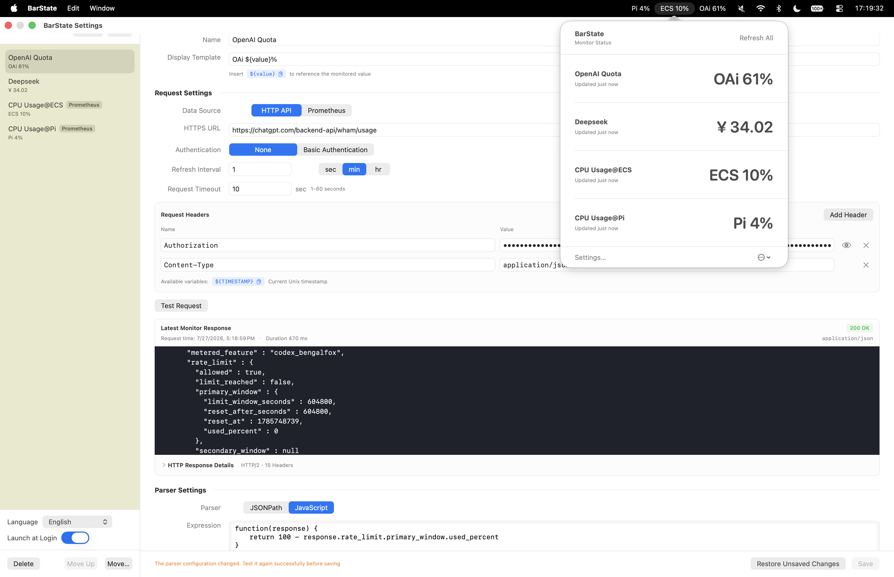

# BarState

[简体中文](README.md) | [English](README_EN.md)

BarState is a macOS menu bar monitoring app with two separate modes: send HTTP requests and parse API responses, or run PromQL queries to read Prometheus metrics. Values from either mode can be displayed directly in the menu bar.

## App Preview



## System Requirements

- macOS 15 or later
- Apple Silicon Macs (M1 or later) and Intel Macs are both first-class supported platforms

## Download and Install

> [!WARNING]
> The current release is not signed with an Apple Developer ID and has not been notarized by Apple. Download the app only from this repository's Releases page.

1. Download the installer for your Mac architecture from [Releases](../../releases):
   - Apple Silicon: `BarState-macos-arm64.dmg`
   - Intel: `BarState-macos-x86_64.dmg`
2. Open the downloaded DMG and drag `BarState.app` into the Applications folder.
3. Double-click `BarState.app` to launch it.
4. If macOS blocks the app, open System Settings → Privacy & Security.
5. Find BarState in the Security section, click Open Anyway, and confirm with your login password or Touch ID.

Alternatively, after confirming that the app came from this repository's Releases page, remove BarState's download quarantine attribute in Terminal:

```sh
xattr -dr com.apple.quarantine "/Applications/BarState.app"
```

This command affects BarState only and does not disable Gatekeeper globally.

You do not need to disable Gatekeeper globally, and doing so is not recommended.

## HTTP Request Monitoring

HTTP request monitoring is designed for extracting numeric values from standard API responses. BarState sends requests on a schedule, then parses each response with JSONPath or JavaScript.

### Create an HTTP Request Monitor

1. Launch BarState, click `BarState` in the menu bar, and select Settings.
2. Click Add in the sidebar and leave Data Source set to `API`.
3. Enter a name and an HTTPS endpoint URL.
4. Configure Basic Authentication or add request headers if the endpoint requires them.
5. Click Test Request and confirm that the endpoint returns the expected response.
6. Choose JSONPath or JavaScript and enter a parser expression.
7. Click Test Parser and confirm that it returns a numeric value.
8. Set the display template and refresh interval, then save the monitor.
9. Turn on Enable Monitor. To show the result directly in the menu bar, also turn on Show in Menu Bar.

A new HTTP request monitor must pass both the request and parser tests before it can be saved.

### Configure the HTTP Request

The API data source currently supports HTTPS `GET` requests only. HTTP endpoints, other request methods, and request bodies are not supported.

For HTTP Basic Authentication, choose `Basic Authentication` under Authentication and enter the username and password. BarState generates the `Authorization` header automatically.

For Bearer tokens, API keys, and other authentication schemes, add one or more headers in the Request Headers section. For example:

```text
Authorization: Bearer your-token
```

You can use `${TIMESTAMP}` in the URL, header names, and header values. BarState replaces it with the current Unix timestamp in seconds when sending the request.

You cannot add a custom `Authorization` header while Basic Authentication is enabled.

After configuring the request, click Test Request. The response preview shows the body, status code, Content-Type, request time, and response headers.

### Parse the HTTP Response

#### JSONPath

For JSON responses, BarState supports a simplified JSONPath syntax with the `$` root, property access, and array indexes.

For example, given this response:

```json
{
  "data": {
    "temperatures": [23.6]
  }
}
```

Use the following expression to extract `23.6`:

```text
$.data.temperatures[0]
```

#### JavaScript

Use JavaScript when you need custom processing or when the endpoint returns non-JSON text. The function receives a `response` parameter and must return a number or a numeric string.

```javascript
function(response) {
    return response.data.temperatures[0]
}
```

For a plain-text response, process the string directly:

```javascript
function(response) {
    return Number(response.trim())
}
```

After changing the parser type or expression, run Test Parser successfully before saving the new configuration.

### Three Common Use Cases

The parser expressions below match the example responses. Adjust them to fit the structure returned by your API.

1. Show the remaining API quota:

   ```json
   {"data":{"remaining":842}}
   ```

   Use the JSONPath `$.data.remaining` and a display template such as `Quota ${value}`.

2. Show a live exchange rate:

   ```json
   {"rates":{"CNY":7.23}}
   ```

   Use the JSONPath `$.rates.CNY` and a display template such as `USD/CNY ${value}`.

3. Show a temperature sensor that returns plain text:

   ```text
   23.6
   ```

   Use JavaScript to convert the text to a number:

   ```javascript
   function(response) {
       return Number(response.trim())
   }
   ```

   Use a display template such as `Temperature ${value}°C`.

## PromQL Query Monitoring

PromQL query monitoring reads Prometheus metrics directly and does not use JSONPath or JavaScript. BarState runs Prometheus instant queries on a schedule and displays the resulting single numeric value in the menu bar.

### Create a PromQL Query Monitor

1. Create a monitor and switch Data Source to `Prometheus`.
2. Enter the Prometheus address and a PromQL query.
3. Configure Basic Authentication or add authentication headers if required.
4. Click Test Query and confirm that the query returns a single numeric value.
5. Set the display template and refresh interval, then save and enable the monitor.

BarState automatically appends `/api/v1/query` to the Prometheus address. Remote addresses must use HTTPS; local loopback addresses such as `localhost`, `127.x.x.x`, and `::1` may use HTTP.

The PromQL query must return either a scalar or an instant vector containing exactly one series. If it returns multiple series, use an aggregation such as `sum()`, `avg()`, or `max()`, or add more specific label filters. After creating a monitor or changing its query settings, Test Query must succeed before the monitor can be saved.

### Three Common Use Cases

1. Show API requests per second:

   ```promql
   sum(rate(http_requests_total[5m]))
   ```

2. Show the API 5xx error rate as a percentage:

   ```promql
   100 * sum(rate(http_requests_total{status=~"5.."}[5m])) / sum(rate(http_requests_total[5m]))
   ```

3. Show the percentage of monitored targets that are currently up:

   ```promql
   100 * avg(up)
   ```

## Display and Refresh

The display template must contain `${value}`, which BarState replaces with the parsed result. For example:

```text
Temperature ${value}°C
```

The refresh interval can use seconds, minutes, or hours and must be between 30 seconds and 365 days.

Click any BarState menu bar item to view all monitors, their current status, and their latest update time. You can refresh one monitor or all enabled monitors. The menu bar can show separate monitor items or one consolidated BarState item; separate items support a maximum title length. Hold Command while dragging a menu bar item to change its position.

## Other Settings

- Launch at Login: opens BarState automatically when you sign in to macOS.
- Language: choose Follow System, 简体中文, or English. Restart BarState to apply the change.
- Menu Bar: choose separate items or a single consolidated entry.
- The sidebar supports drag reordering and context-menu clone, move, and delete actions.

## Local Data and Uninstalling

BarState stores monitor settings in:

```text
~/Library/Application Support/BarState/
```

Basic Authentication credentials, request header contents, and the most recent complete response are stored locally. Avoid long-lived or highly privileged credentials, and prefer dedicated credentials that can be revoked.

If configuration files cannot be read, BarState enters a read-only recovery mode so later edits cannot overwrite them. Starting fresh archives the old files with `.corrupt-timestamp.json` names first.

To uninstall BarState:

1. Quit BarState.
2. Move `BarState.app` to the Trash.
3. To remove all monitor settings as well, delete `~/Library/Application Support/BarState/`.

Deleting the settings directory permanently removes its data.

## Run from Source

From the project root, run:

```sh
./scripts/build-app.sh
open .build/BarState.app
```

To run the full set of checks:

```sh
swift test
./scripts/check-localizations.sh
./scripts/test-app-smoke.sh
```

The built app is available at `.build/BarState.app`.
