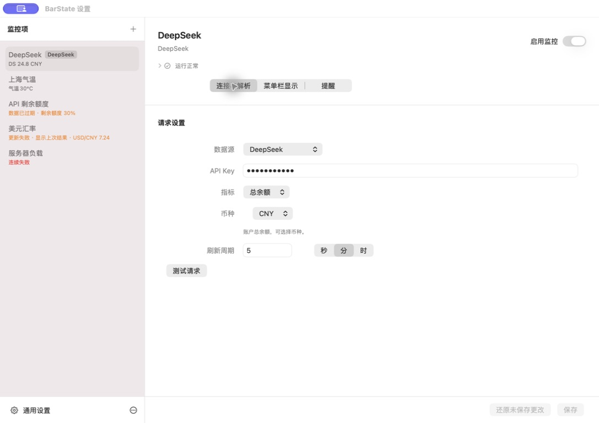

# BarState

[English](README.md) | [简体中文](README_ZH.md)

BarState 是一款 macOS 菜单栏监控工具，支持服务余额、HTTP API 数值、Prometheus 指标和本机 Codex 额度。任意数据源取得的数值都可以直接显示在菜单栏中。

[使用指南](docs/USER_GUIDE.md) · [下载](../../releases) · [隐私说明](PRIVACY.md) · [安全策略](SECURITY.md) · [版本记录](CHANGELOG.md) · [参与贡献](CONTRIBUTING.md)

需要完整的操作说明时，请参阅 [BarState 使用指南](docs/USER_GUIDE.md)。

## 1.0.0 更新

BarState 1.0.0 加入了原生 Settings 分区、DeepSeek / OpenRouter / SiliconFlow 中国站预设、四种 Prometheus 模板、数据新鲜度和可选本地提醒，并移除了菜单栏刷新时临时出现的图标，减少闪动。

查看 [完整迭代计划](docs/NEXT_ITERATION.md)、[验收记录](docs/ITERATION_PROGRESS.md) 和 [使用指南](docs/USER_GUIDE.md)。DeepSeek 与现有 Codex 额度已完成真实账户验证，打包版通知投递和点击定位也已通过；OpenRouter / SiliconFlow 账户、实际重新登录与睡眠/网络恢复、VoiceOver 导航按用户决定本轮跳过，仍未验证。



## 早期版本界面预览

<p align="center">
  
</p>


## 系统要求

- macOS 15 或更高版本
- Apple Silicon（M1 或更新的 Mac）和 Intel Mac 均为首要支持平台

## 下载与安装

> [!WARNING]
> 当前 Release 仅使用临时签名（ad hoc signing），未使用 Apple Developer ID 签名，也未经过 Apple 公证。请只通过官方 Homebrew Tap 或本仓库的 Releases 页面安装。

### Homebrew

通过官方 Tap 安装 BarState。Homebrew 会根据 Apple Silicon 或 Intel Mac 自动选择对应版本：

```bash
brew install --cask yxwuxuanl/tap/barstate
```

升级或卸载：

```bash
brew upgrade --cask barstate
brew uninstall --cask barstate
```

### 手动安装

1. 在 [Releases](../../releases) 页面下载与 Mac 架构对应的安装包：
   - Apple Silicon：`BarState-macos-arm64.dmg`
   - Intel：`BarState-macos-x86_64.dmg`
2. 打开下载的 DMG，将 `BarState.app` 拖入“应用程序”文件夹。
3. 双击 `BarState.app` 尝试启动。
4. 如果 macOS 阻止打开，请进入“系统设置” → “隐私与安全性”。
5. 在“安全性”区域找到 BarState，点击“仍要打开”，然后使用登录密码或 Touch ID 确认。

也可以在确认应用来自本仓库 Releases 后，通过终端移除 BarState 的下载隔离标记：

```sh
xattr -dr com.apple.quarantine "/Applications/BarState.app"
```

此命令只作用于 BarState，不会全局关闭 Gatekeeper。

不需要也不建议为了运行 BarState 而全局关闭 Gatekeeper。

## HTTP 请求监控

HTTP 请求监控适合从普通 API 响应中提取数值。BarState 定时发送请求，再通过 JSONPath 或 JavaScript 解析响应。

### 创建 HTTP 请求监控

1. 启动 BarState，点击菜单栏中的 `BarState`，选择“设置…”。
2. 点击左侧“新增”，选择“自定义 HTTP API”。
3. 填写监控项名称和 HTTPS 接口地址。
4. 如有需要，配置 Basic Authentication 或添加请求头。
5. 点击“测试请求”，确认接口返回了预期内容。
6. 选择 JSONPath 或 JavaScript 解析方式，填写解析表达式。
7. 点击“测试解析”，确认能够得到数值。
8. 设置刷新周期，在“菜单栏显示”中填写模板，然后保存。
9. 开启“启用监控”；需要在菜单栏直接显示结果时，再开启“显示在菜单栏”。

新建 HTTP 请求监控必须先完成请求测试并成功解析，之后才能保存。

### 配置 HTTP 请求

API 数据源目前只支持 HTTPS `GET` 请求，不支持 HTTP、其他请求方法或请求体。

接口使用 HTTP Basic Authentication 时，在“认证方式”中选择 `Basic Authentication`，然后填写用户名和密码。BarState 会自动生成 `Authorization` 请求头。

Bearer Token、API Key 等其他认证方式可以在“请求头”区域添加多组 Header，例如：

```text
Authorization: Bearer your-token
```

URL、请求头名称和请求头值都可以使用 `${TIMESTAMP}`。发送请求时，它会被替换为当前 Unix 秒级时间戳。

启用 Basic Authentication 时，不能再手动添加 `Authorization` 请求头。

配置完成后点击“测试请求”。响应预览会显示 Body、状态码、Content-Type、请求时间和响应头等信息。

### 解析 HTTP 响应

#### JSONPath

JSON 响应可以使用简化 JSONPath，支持根节点 `$`、属性访问和数组下标。

例如，接口返回：

```json
{
  "data": {
    "temperatures": [23.6]
  }
}
```

使用以下表达式可取得 `23.6`：

```text
$.data.temperatures[0]
```

#### JavaScript

需要自定义处理逻辑，或接口返回的不是 JSON 时，请使用 JavaScript。函数接收 `response` 参数，并返回数字或数字字符串。

```javascript
function(response) {
    return response.data.temperatures[0]
}
```

如果响应是普通文本，可以直接处理字符串：

```javascript
function(response) {
    return Number(response.trim())
}
```

修改解析方式或表达式后，需要再次点击“测试解析”并成功，才能保存新配置。

### 三个常用场景

以下解析表达式基于示例响应，实际使用时需要按照接口返回的数据结构调整。

1. 查看 API 剩余额度：

   ```json
   {"data":{"remaining":842}}
   ```

   使用 JSONPath `$.data.remaining`，显示模板可设置为 `额度 ${value}`。

2. 查看实时汇率：

   ```json
   {"rates":{"CNY":7.23}}
   ```

   使用 JSONPath `$.rates.CNY`，显示模板可设置为 `USD/CNY ${value}`。

3. 查看返回纯文本的温度传感器：

   ```text
   23.6
   ```

   使用 JavaScript 将文本转换为数字：

   ```javascript
   function(response) {
       return Number(response.trim())
   }
   ```

   显示模板可设置为 `温度 ${value}℃`。

## Codex 额度监控

Codex 额度监控读取本机当前登录 Codex 账号的主要限额周期，并显示剩余百分比。

1. 登录 Codex，确保 `~/.codex/auth.json` 已存在。
2. 在 BarState 中选择“新增”→“Codex”。
3. 点击“测试额度”，再设置显示模板和刷新周期。
4. 保存并启用监控。

BarState 会调用 `https://chatgpt.com/backend-api/wham/usage`，按 `100 - used_percent` 计算显示值。每次请求时都会从 `~/.codex/auth.json` 读取凭据，但不会将凭据复制到 BarState 设置。持久化的响应预览只保留 `rate_limit` 对象，不包含账号 ID、用户 ID 或邮箱地址。

## PromQL 查询监控

PromQL 查询监控用于直接读取 Prometheus 指标，不需要配置 JSONPath 或 JavaScript。BarState 会定时调用 Prometheus 即时查询接口，并将查询得到的单个数值显示在菜单栏中。

### 创建 PromQL 查询监控

1. 点击“新增”，选择 `Prometheus`。
2. 填写 Prometheus 地址，选择模板并指定目标，或填写自定义 PromQL。
3. 如有需要，配置 Basic Authentication 或添加认证请求头。
4. 点击“测试查询”，确认查询能够得到单个数值。
5. 设置显示模板和刷新周期，保存并启用监控。

BarState 会在 Prometheus 地址后自动补全 `/api/v1/query`。远程地址必须使用 HTTPS；`localhost`、`127.x.x.x` 和 `::1` 等本机环回地址可以使用 HTTP。

PromQL 必须返回一个标量或仅包含一条时间序列的即时向量。如果返回多条时间序列，请先细化目标标签；只有确实需要汇总这些序列时才使用聚合函数。新建监控项或修改查询配置后，需要先点击“测试查询”并成功，才能保存。

### 三个常用场景

1. 查看 API 每秒请求量：

   ```promql
   sum(rate(http_requests_total[5m]))
   ```

2. 查看 API 的 5xx 错误率（百分比）：

   ```promql
   100 * sum(rate(http_requests_total{status=~"5.."}[5m])) / sum(rate(http_requests_total[5m]))
   ```

3. 查看所有监控目标的当前在线率（百分比）：

   ```promql
   100 * avg(up)
   ```

## 显示与刷新

显示模板必须包含 `${value}`，它会被替换为解析结果。例如：

```text
气温 ${value}℃
```

刷新周期可以使用秒、分或时，允许范围为 30 秒至 365 天。

点击任意 BarState 菜单栏项目可以查看全部监控项、当前状态和最近更新时间，也可以刷新单个监控项或全部已启用项。菜单栏既可让每个监控项独立显示，也可合并为一个 BarState 入口；独立模式支持限制标题最大长度。按住 Command 键拖动菜单栏项目，可以调整它们的位置。

## 其他设置

应用级偏好集中在侧栏底部的“通用设置”；监控自己的显示和提醒在右侧对应分区。

- “登录时启动”：登录 macOS 后自动打开 BarState。
- “语言”：支持跟随系统、简体中文和 English；更改后重新启动 BarState 生效。
- “菜单栏”：可选择每项独立显示或单一聚合入口。
- 左侧监控项列表支持拖动排序、右键克隆/移动/删除。

## 本地数据与卸载

监控配置保存在：

```text
~/Library/Containers/com.barstate.BarState/Data/Library/Application Support/BarState/
```

未使用应用沙盒的源码运行环境可能使用 `~/Library/Application Support/BarState/`。Basic Authentication 凭据、预设 API Key、请求头内容和最近响应保存在本机。服务预设只保留必要指标及诊断摘要；自定义 HTTP 和 Prometheus 保留最近响应。Codex 凭据不会复制到 BarState，Codex 响应只保存限额数据。请避免使用长期有效或权限过高的凭据，并尽量使用可随时撤销的专用凭据。

配置异常时 BarState 会进入只读恢复模式，避免后续操作覆盖损坏文件。选择重新开始前，旧文件会先以 `.corrupt-时间戳.json` 的形式归档。

卸载步骤：

1. 退出 BarState。
2. 将 `BarState.app` 移到废纸篓。
3. 如需同时删除全部监控配置，再删除 `~/Library/Containers/com.barstate.BarState/Data/Library/Application Support/BarState/`。

删除配置目录后无法恢复其中的数据。

## 从源码运行

在项目根目录执行：

```sh
./scripts/build-app.sh
open .build/BarState.app
```

运行完整检查：

```sh
swift test
./scripts/check-localizations.sh
./scripts/test-app-smoke.sh
```

构建完成后的应用位于 `.build/BarState.app`。如果遇到实施记录中的本机 Command Line Tools / SDK 混装问题，可用 `./scripts/test-local-toolchain.sh` 运行同一套测试。构建与冒烟脚本支持用 `BARSTATE_BUILD_ARCH=arm64` 或 `x86_64` 选择架构，以 `BARSTATE_BUILD_DIR` 指定输出目录。

## 隐私与安全

BarState 不包含分析、广告或遥测服务，也不使用开发者运营的后端；应用会连接你主动配置的接口，并在启用时连接上述 Codex 额度接口。监控数据保存在本机。为敏感接口配置监控前，请阅读[隐私说明](PRIVACY.md)和[安全策略](SECURITY.md)。

## 参与贡献

欢迎提交 Issue 和 Pull Request。开发环境及检查要求请参阅 [CONTRIBUTING.md](CONTRIBUTING.md)，版本变化记录在 [CHANGELOG.md](CHANGELOG.md) 中。

## 开源许可

BarState 是自由开源软件，采用 [MIT License](LICENSE) 发布。
