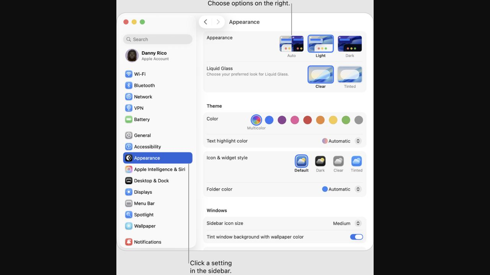
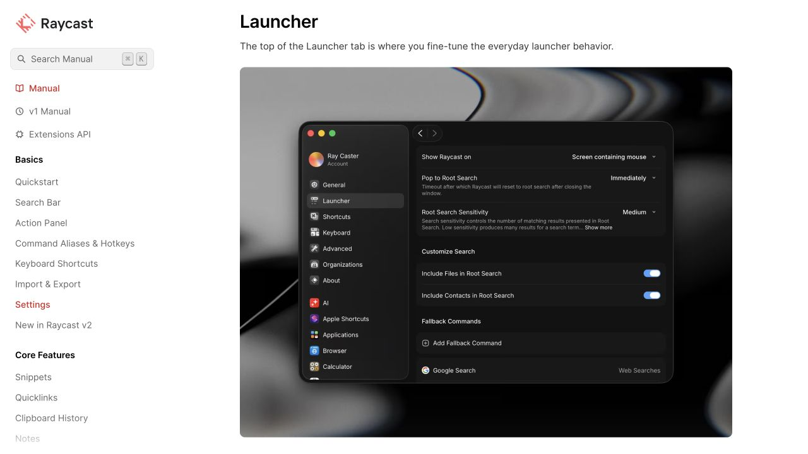
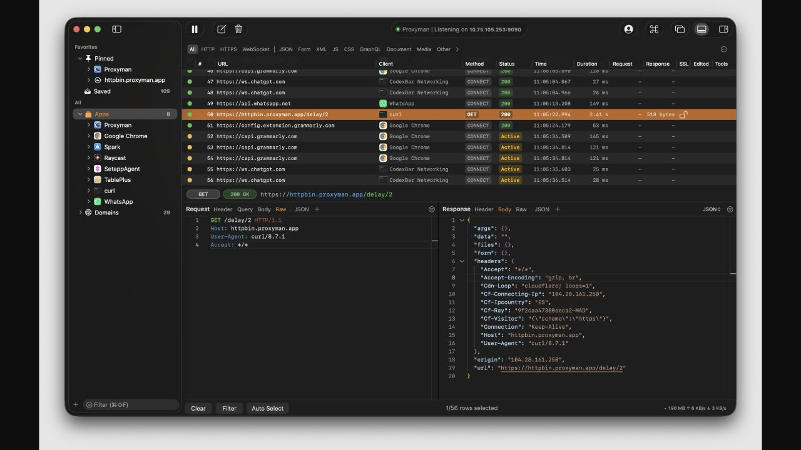

# Settings 样式参考

本文为 [完整迭代计划](NEXT_ITERATION.md) 的视觉参考附件；实施范围与顺序以主计划为准。

用户已确认原生 macOS 侧栏与任务分区方向。本页比较该方向内的样式；以下均为官方页面的实际界面截图，由浏览器捕获于 2026-09-06，不是 BarState 效果图。

用户已确认：以 Apple 系统设置的表单样式为基础，吸收 Raycast 的信息密度，将 Proxyman 的技术内容组织方式用于连接与解析分区。实现情况见 [实施记录](ITERATION_PROGRESS.md)。

## 1. Apple 系统设置：轻盈、清楚的原生表单

[官方来源：Customize your Mac with System Settings](https://support.apple.com/guide/mac-help/change-system-settings-mh15217/mac)

观察：浅色侧栏、明确选择态、低对比分组背景；每行左侧说明、右侧控件；同组使用细分隔，组间留出空间。图中为 macOS Tahoe 的外观设置。

适合 BarState：通用设置、菜单栏显示和提醒表单。把一个主题的多个设置放入同一组，短字段保持紧凑，帮助文字紧随对应设置。

取舍：系统设置的内容以开关和选择项为主。BarState 的 URL、PromQL 和脚本需给足输入宽度与高度，不能全部压成单行。

## 2. Raycast 设置：紧凑而有层级

[官方来源：Settings — Launcher](https://manual.raycast.com/settings#launcher)

观察：较窄的侧栏、克制的标题、紧凑控件和清楚的组标题；辅助文案降为次级颜色；深色背景靠明度区分区域，而不是大面积亮色。

适合 BarState：左栏监控列表和右侧设置密度。名称、来源和状态保持明确主次，让常用操作在较小窗口里仍然集中。

取舍：说明文字过多会让紧凑界面显得繁忙。BarState 应优先显示当前操作需要的信息，详细解释可展开。参考图为深色，不意味着 BarState 默认或仅支持深色。

## 3. Proxyman：专业的请求与响应区域

[官方来源：Proxyman — Native macOS app](https://proxyman.com/)

观察：运行状态与内容区分开；请求/响应具有明确标题和局部分页；结构化内容使用等宽字体、语法颜色与细分隔，能够在高密度下保持区域边界。

适合 BarState：连接与解析页中的测试结果、响应 Body、Header 和表达式。测试状态放在区域顶部，展开完整响应时再提供足够空间。

取舍：这是网络调试工作台参考，整体密度高于 BarState。借鉴范围限定在连接调试局部；普通设置仍采用前两组参考的表单样式。语法高亮属于额外能力，应独立确定范围。

## 已确认组合

| BarState 区域 | 主要参考 | 具体落点 |
| --- | --- | --- |
| 窗口与表单 | Apple | 系统背景、原生控件、低对比分组、清晰行对齐 |
| 监控侧栏与信息密度 | Raycast | 紧凑列表、克制标题、名称/辅助信息层级 |
| 连接测试与响应 | Proxyman | 状态摘要、局部分页、清晰的文本与代码区域 |

深浅色跟随系统。采用系统提供的材料与控件适配，不把某一系统版本的玻璃效果硬编码为 macOS 15 的实现要求。
