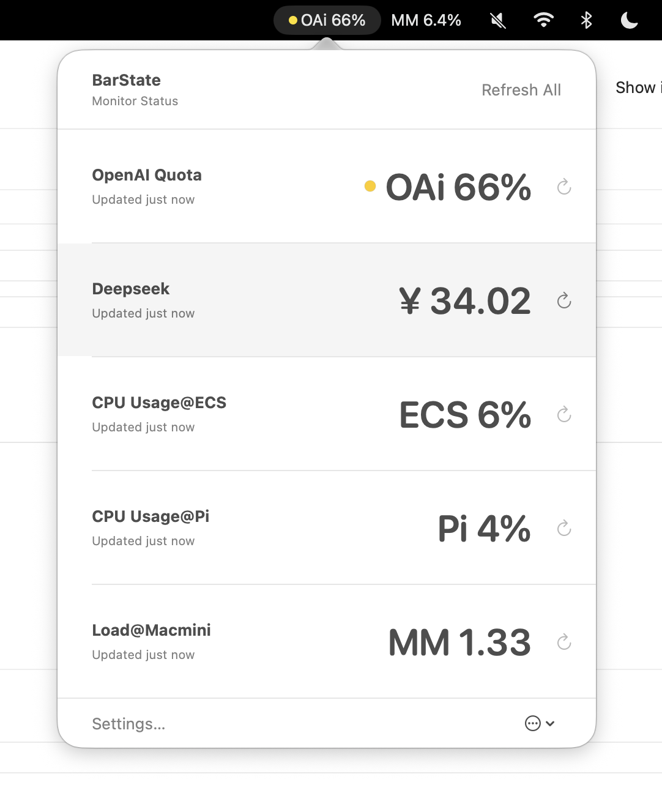
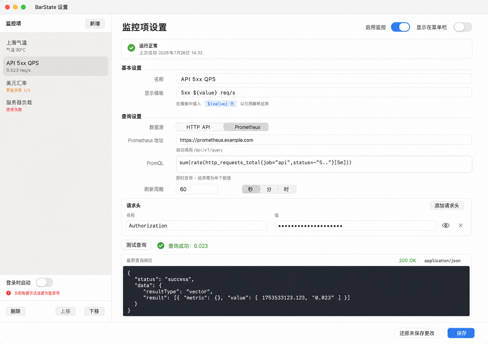

# BarState 使用指南

BarState 是一款 macOS 菜单栏监控工具。它会按设定周期查询 HTTP API 或 Prometheus，从响应中取得一个数值，再将结果显示在菜单栏中。适合查看温度、汇率、API 额度、服务负载、错误率等需要随时关注的指标。

## 1. 安装与启动

### 系统要求

- macOS 15 或更高版本
- Apple Silicon（M1 或更新的 Mac）和 Intel Mac 均为首要支持平台

### 安装 Release 版本

1. 从本仓库的 Releases 页面下载与 Mac 架构对应的安装包：
   - Apple Silicon：`BarState-macos-arm64.dmg`
   - Intel：`BarState-macos-x86_64.dmg`
2. 打开下载的 DMG，将 `BarState.app` 拖入“应用程序”文件夹。
3. 双击 `BarState.app`。
4. 如果 macOS 阻止启动，打开“系统设置” → “隐私与安全性”，在“安全性”区域找到 BarState，点击“仍要打开”并确认。

当前 Release 未使用 Apple Developer ID 签名，也未经过 Apple 公证。请只使用本仓库提供的安装包，不要为了运行 BarState 而全局关闭 Gatekeeper。

启动后，BarState 会出现在菜单栏。没有任何监控项显示在菜单栏时，入口名称为 `BarState`。

## 2. 五分钟快速上手

下面以一个返回 JSON 的天气接口为例。假设接口响应为：

```json
{
  "data": {
    "temperature": 23.6
  }
}
```

1. 点击菜单栏中的 `BarState`，选择“设置…”。
2. 点击左侧“新增”。
3. 名称填写 `室外温度`。
4. 显示模板填写 `温度 ${value}℃`。
5. 数据源选择 `HTTP API`，填写接口的 HTTPS URL。
6. 点击“测试请求”，确认响应预览中出现预期 JSON。
7. 解析方式选择 `JSONPath`，表达式填写 `$.data.temperature`。
8. 点击“测试解析”，确认得到 `23.6`。
9. 设置刷新周期，点击“保存”。
10. 打开“启用监控”和“显示在菜单栏”。

新建 HTTP API 监控项必须成功完成“测试请求”和“测试解析”后才能保存。

## 3. 认识界面

### 菜单栏

开启“启用监控”和“显示在菜单栏”后，每个监控项会成为一个独立的文字菜单栏项目。点击任意 BarState 菜单栏项目，都会打开同一份监控列表。

<p align="center">
  
</p>

监控列表中可以：

- 查看全部监控项的当前值、状态和最近更新时间；
- 点击某一行，直接打开该监控项的设置；
- 点击某行右侧的刷新按钮，只刷新该监控项；
- 点击“刷新全部”或“刷新启用项”，立即刷新所有已启用的监控项；
- 点击“设置…”管理监控项；
- 从右下角的更多菜单退出 BarState。

按住 Command 键拖动菜单栏项目，可以调整其在 macOS 菜单栏中的位置。也可以按住 Command 将某个项目拖出菜单栏；这样会同时关闭该监控项的“显示在菜单栏”。

### 设置窗口

设置窗口左侧是监控项列表，右侧是当前监控项的配置和运行状态。首次使用时可以直接选择 HTTP API、Prometheus 或 JSON 数值模板。新建流程会按照“连接 → 提取/查询 → 展示”显示当前进度，认证、请求头和超时位于可折叠的高级设置中。

左下方可以更改语言、菜单栏显示方式、单项标题最大长度和登录启动设置。监控项可以拖动排序，也可以通过右键菜单克隆、移动或删除。

对于已经保存的监控项，“启用监控”和“显示在菜单栏”两个开关会立即生效；其他修改需要点击“保存”。

## 4. 创建 HTTP API 监控

### 基本设置

| 设置 | 说明 |
| --- | --- |
| 名称 | 用于设置列表、监控弹窗和菜单栏提示，例如“API 剩余额度”。 |
| 显示模板 | 必须包含 `${value}`，例如 `剩余额度 ${value}%`。所有 `${value}` 都会替换为解析结果。 |
| 刷新周期 | 支持秒、分、时，范围为 30 秒至 365 天。 |
| 请求超时 | 范围为 1–60 秒，默认 10 秒。 |
| 启用监控 | 开启后才会自动请求，也会被“刷新全部”包含。 |
| 显示在菜单栏 | 与“启用监控”同时开启时，结果才会直接显示在菜单栏。 |

数值通常最多显示 6 位小数；绝对值特别大或特别小时会自动使用科学计数法。

### 配置请求

HTTP API 模式目前只支持 HTTPS `GET` 请求，不支持普通 HTTP、其他请求方法或请求体。

如果接口使用 HTTP Basic Authentication，在“认证方式”中选择 `Basic Authentication`，填写用户名和密码。密码默认遮挡，可通过眼睛按钮临时显示。BarState 会使用 UTF-8 编码凭据并自动生成标准 `Authorization: Basic …` 请求头。

用户名不能包含冒号；密码可以包含冒号。启用 Basic Authentication 时，不能再手动添加 `Authorization` 请求头。

Bearer Token、API Key 等其他认证方式可以点击“添加请求头”，填写一组或多组 Header，例如：

```text
Authorization: Bearer your-token
```

Header 名称不能为空或重复。`Authorization`、`Cookie`、`X-API-Key` 等常见敏感 Header 的值会在编辑器中遮挡，可通过眼睛按钮临时显示。

以下位置支持 `${TIMESTAMP}`：

- URL；
- 请求头名称；
- 请求头值。

每次发送请求时，`${TIMESTAMP}` 会替换为当前 Unix 秒级时间戳。例如：

```text
https://api.example.com/value?ts=${TIMESTAMP}
X-Request-Time: ${TIMESTAMP}
```

点击界面中的变量标签可以将变量复制到剪贴板。

### 测试请求

点击“测试请求”后，响应预览会显示：

- 响应 Body；
- 请求时间与耗时；
- HTTP 状态码和 Content-Type；
- 可展开的 HTTP 状态行与完整响应头。

BarState 只会将 `2xx` 视为成功。单次响应最大为 2 MiB；超过限制会终止读取并显示错误。

修改 URL、认证方式、凭据、请求头或请求超时后，已有预览会被标记为过期。此时应重新测试请求，再测试解析。

### 使用 JSONPath 解析

JSONPath 适用于结构固定的 JSON 响应。BarState 支持的是简化语法：

- `$`：根节点；
- `.property`：读取对象属性；
- `[0]`：按非负整数下标读取数组元素。

例如：

```json
{
  "data": {
    "temperatures": [23.6]
  }
}
```

对应表达式为：

```text
$.data.temperatures[0]
```

JSONPath 最终指向的内容必须是数字或数字字符串，例如 `23.6` 或 `"23.6"`。布尔值、对象、数组、空值以及 `NaN`、`Infinity` 等非有限数不能作为结果。

当前简化 JSONPath 不支持通配符、过滤器、递归查找、负数下标或带引号的属性下标。属性名本身含有 `.` 或 `[` 时，建议改用 JavaScript。

### 使用 JavaScript 解析

以下情况适合使用 JavaScript：

- 响应是普通文本而不是 JSON；
- 需要运算、条件判断或组合多个字段；
- JSON 属性名不适合简化 JSONPath；
- 需要将百分比、单位等文本转换成数字。

解析函数接收一个 `response` 参数：JSON 响应会传入对象或数组，文本响应会传入字符串。函数必须返回数字或数字字符串。

处理 JSON：

```javascript
function(response) {
    return response.used / response.total * 100
}
```

处理纯文本：

```javascript
function(response) {
    return Number(response.trim().replace("%", ""))
}
```

也可以只填写函数体；BarState 会自动将其包装成 `function(response) { ... }`。JavaScript 在独立的受限服务中执行，不能用来发送网络请求。

### 测试并保存

“测试解析”使用当前响应预览，不会再次联网。解析成功后，旁边会显示最终数值。

以下情况需要重新测试：

- 新建 HTTP API 监控项；
- 修改了解析方式；
- 修改了 JSONPath 或 JavaScript 内容；
- 请求配置变化后，需要先重新测试请求，才能针对新响应测试解析。

测试成功后点击“保存”。尚未保存的新监控项不会启动自动刷新，也不会写入本地配置。

## 5. 创建 Prometheus 监控

Prometheus 模式直接调用即时查询 API，适合将 PromQL 的单个查询结果显示在菜单栏。

<p align="center">
  
</p>

1. 新建监控项，将“数据源”切换为 `Prometheus`。
2. 填写 Prometheus 地址，例如 `https://prometheus.example.com`。
3. 填写 PromQL。
4. 如有需要，配置 Basic Authentication 或添加认证 Header。
5. 点击“测试查询”。查询成功时会直接显示取得的数值。
6. 设置显示模板和刷新周期，保存并启用监控。

### 地址规则

BarState 会自动调用 `/api/v1/query`：

- `https://prometheus.example.com` 会请求 `https://prometheus.example.com/api/v1/query`；
- `https://example.com/prometheus` 会请求 `https://example.com/prometheus/api/v1/query`；
- 如果地址已经以 `/api/v1/query` 结尾，则不会重复添加。

远程地址必须使用 HTTPS。只有本机环回地址可以使用 HTTP，包括 `localhost`、`127.x.x.x` 和 `::1`。

### 查询结果要求

BarState 支持 Prometheus 即时查询返回的：

- `scalar` 标量；
- 只包含一条时间序列的 `vector` 向量。

查询结果必须能转换为一个有限数值。空向量、多条时间序列、范围查询矩阵和直方图结果都不能直接显示。

如果查询返回多条时间序列，可使用 `sum()`、`avg()`、`max()` 等 PromQL 聚合函数，或添加更精确的标签筛选，使结果收敛为单个值。例如：

```promql
sum(rate(http_requests_total{job="api",status=~"5.."}[5m]))
```

“测试查询”会一次完成请求和结果解析。新建 Prometheus 监控，或修改其地址、PromQL、认证配置、请求头、超时等查询配置后，必须重新测试成功才能保存。

## 6. 查看状态与刷新结果

BarState 会在设置页和监控列表中显示以下状态：

| 状态 | 含义 |
| --- | --- |
| 等待首次更新 | 已保存并启用，但还没有成功取得数值。 |
| 正在刷新 | 请求正在进行。 |
| 运行正常 | 最近一次请求和解析成功。 |
| 更新失败 1/3 或 2/3 | 最近更新失败，但仍保留并显示上一次成功值。 |
| 连续失败 | 已连续失败 3 次或更多；显示值改为 `--`。 |
| 已停用 | 不会自动请求，也不会参与手动刷新。 |

一次成功更新会清零连续失败次数。菜单栏项目显示的是显示模板处理后的结果；将鼠标停留在项目上可以看到监控项名称。

点击监控弹窗右上角的“刷新全部”可立即刷新已启用的监控项。按钮在刷新进行中或没有可刷新项时不可用。

每个监控项右侧也提供单项刷新按钮。按 `Command-R` 可以刷新全部监控项，按 `Command-,` 可以打开设置。

## 7. 管理监控项

在设置窗口左侧可以：

- 点击“新增”创建监控项；
- 直接拖动监控项调整顺序，或使用右键菜单移动、克隆和删除；
- 选择监控项并点击“上移”或“下移”调整列表顺序；
- 点击“删除”永久删除监控项及其历史状态；
- 点击监控项名称切换编辑对象。

如果切换监控项或关闭窗口时存在未保存修改，BarState 会询问是否放弃修改。已有监控项可以使用“还原未保存更改”恢复到最近一次保存的配置。

## 8. 通用设置

### 菜单栏显示

- “每项单独显示”会为每个已开启“显示在菜单栏”的监控项创建独立入口，并按设置的最大字符数截断过长标题；
- “单一入口”只显示一个 BarState 项目。出现最近失败时标题会显示失败数量，连续失败会使用更醒目的标记；
- 两种模式打开的都是同一份完整监控列表。

### 登录时启动

开启“登录时启动”后，BarState 会在登录 macOS 时自动打开。如果设置失败，错误信息会显示在开关下方。

### 语言

支持以下选项：

- 跟随系统；
- 简体中文；
- English。

语言更改会在下次启动 BarState 时生效。选择后可立即退出，也可以稍后自行重新启动。

## 9. 本地数据与隐私

BarState 不使用云端账户。配置和最近运行状态保存在：

```text
~/Library/Application Support/BarState/
```

主要文件为 `state.json` 和 `state.backup.json`，文件权限会限制为仅当前 macOS 用户可读写。

如果主文件损坏但备份可读取，BarState 会以只读方式载入备份，等待你恢复或导出副本。如果两个文件都无法读取，应用会阻止所有配置写入；选择“归档并重新开始”后，旧文件会先重命名保留，再创建空配置。

Basic Authentication 用户名与密码、请求头的完整值和最近一次完整响应会以明文保存在这些本地文件中。即使界面遮挡了密码或敏感 Header，它也不等于使用钥匙串加密。建议：

- 使用权限最小、可随时撤销的专用 Token；
- 避免填写长期有效或权限过高的 Cookie、API Key；
- 避免监控会返回密码、个人信息等高度敏感内容的接口；
- 分享配置文件或故障截图前，先检查其中是否包含凭据和响应数据。

## 10. 常见问题

### “保存”按钮不可用

常见原因包括：

- 当前没有未保存的修改；
- 请求或解析测试仍在进行；
- 新建 HTTP API 监控尚未成功测试解析；
- 修改了解析配置但尚未重新测试；
- Prometheus 查询配置变化后尚未重新测试查询。

窗口底部会显示当前缺少的步骤或字段错误。

### “测试解析”按钮不可用

先确认已经成功执行“测试请求”。如果修改了 URL、认证配置、请求头或超时，旧响应会变为过期，需要重新测试请求。二进制响应不能解析；非 JSON 文本只能使用 JavaScript。

### JSONPath 提示找不到值

检查属性名称的大小写和数组下标，并确认表达式从 `$` 开始。可以直接对照响应预览逐层填写，例如：

```text
$.data.items[0].value
```

如果响应结构不固定或属性名含特殊字符，改用 JavaScript 通常更方便。

### JavaScript 提示结果不是数字

确认函数使用 `return`，并且返回数字或可转换为数字的字符串。不要返回对象、数组、布尔值、`undefined`、`NaN` 或 `Infinity`。

### Prometheus 提示返回多条时间序列

当前查询返回了向量中的多个元素。增加标签筛选，或使用 `sum()`、`avg()` 等聚合函数，让查询只产生一条时间序列。

### 菜单栏没有显示监控值

确认该监控项同时开启了“启用监控”和“显示在菜单栏”。如果之前将项目拖出了菜单栏，重新打开“显示在菜单栏”即可恢复。

### 显示的是旧值或 `--`

前两次连续失败会保留上一次成功值，并标记“上次值”；连续失败达到 3 次后显示 `--`。点击该监控项可查看具体错误、上次尝试时间和下次刷新时间。

### 请求频繁超时或响应过大

请求超时最多可设置为 60 秒。BarState 只读取不超过 2 MiB 的响应；如果接口返回内容很大，建议改用只返回目标指标的轻量接口，或在服务端先聚合结果。

## 11. 退出与卸载

退出 BarState：点击菜单栏项目，在弹窗右下角打开更多菜单，然后选择“退出 BarState”。

完整卸载：

1. 退出 BarState。
2. 将 `BarState.app` 移到废纸篓。
3. 如果还要删除全部监控配置和历史状态，再删除：

   ```text
   ~/Library/Application Support/BarState/
   ```

删除配置目录后，其中的数据无法恢复。
