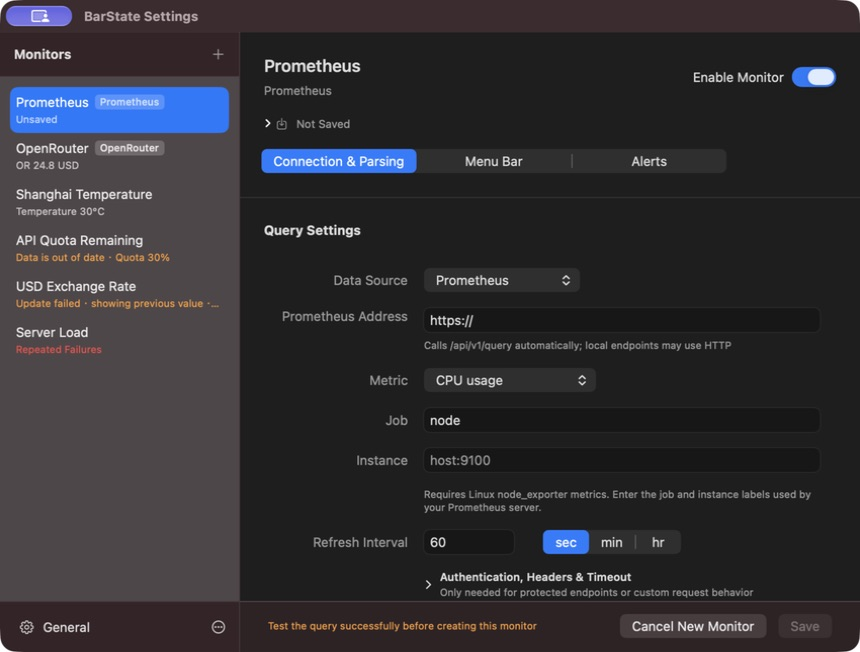

# BarState User Guide

BarState displays numeric API results, service balances, Prometheus metrics, and local Codex quota in the macOS menu bar.

This guide describes BarState 1.0.0. See the [validation record](ITERATION_PROGRESS.md) for completed and deferred checks, and the [changelog](../CHANGELOG.md) for version history. [简体中文](USER_GUIDE.md).

## Install and open

BarState requires macOS 15 or later and supports Apple Silicon and Intel Macs. Follow the [installation instructions](../README.md#download-and-install) for the current release, or [build from source](../README.md#run-from-source) to try development changes.

Open BarState from Applications, click its menu bar item, and choose Settings. If no monitor is visible in the menu bar, the entry is named BarState.

## Settings and drafts

The sidebar lists monitors and their current value or status. Add opens a source catalog. General, at the bottom of the sidebar, contains language, menu bar mode, title length, and launch-at-login preferences.

Each monitor has three sections sharing one draft:

- **Connection & Parsing**: credentials, metrics or queries, refresh interval, and connection tests. Advanced authentication and response details expand when needed.
- **Menu Bar**: visibility, a display template containing `${value}`, a preview, and numeric color rules.
- **Alerts**: one optional rule, recovery notifications, and system permission status.

Switching sections preserves edits and test results. Switching monitors, opening General, or closing the window protects unsaved changes. Save and Restore Unsaved Changes stay at the bottom; validation failures return to the relevant section. For saved monitors, Enable Monitor and Show in Menu Bar apply immediately. Other edits require Save.


## Add a service preset

Click Add, select a provider, enter its API key, choose a metric, and test before saving. Presets supply the endpoint, parser, currency, and initial display template. The default refresh interval is five minutes.

| Provider | Metrics | Details |
| --- | --- | --- |
| DeepSeek | Total account balance | Choose CNY or USD. The matching currency entry is used, including valid negative balances. |
| OpenRouter | Daily usage, monthly usage, remaining key budget | Uses an ordinary API key and USD. An unset key budget is unavailable, not zero; choose a usage metric or set a budget with the provider. |
| SiliconFlow China | Total balance | Uses the China endpoint and CNY. The international site is not included. |

Each monitor displays one metric. Create additional monitors for other metrics from the same service. Changing credentials, provider, metric, or currency requires a fresh test. Missing fields, business errors, and invalid numbers fail the test rather than becoming zero. Existing monitors retain their last successful result when an update fails. Accounting delays remain under the provider's control.

## Add a custom HTTP monitor

1. Choose Custom HTTP API in Add.
2. Enter a name and HTTPS URL in Connection & Parsing.
3. Expand authentication settings if Basic Authentication or custom headers are needed.
4. Run Test Request and inspect the response.
5. Select JSONPath or JavaScript, enter an expression, and run Test Parser.
6. Set the refresh interval and the Menu Bar display template, then save.

Custom HTTP supports HTTPS GET. For a Bearer token, add an `Authorization: Bearer your-token` header. Basic Authentication generates that header automatically, so a custom Authorization header cannot be used at the same time. `${TIMESTAMP}` in URLs or headers is replaced with the Unix timestamp when sending a request.

For `{"data":{"temperature":23.6}}`, use `$.data.temperature`. JSONPath supports the `$` root, property access, and nonnegative array indexes. It does not support wildcards or filters.

JavaScript receives a parsed JSON object or a text string and must return a finite number or numeric string:

```javascript
function(response) {
    return response.used / response.total * 100
}
```

Parsers run locally in an isolated service. Test Parser uses the current response without making another request. Changing request configuration invalidates the previous response for testing. New monitors and changed parsing configurations must pass their required tests before saving. Responses are limited to 2 MiB; timeouts range from 1 to 60 seconds.

## Add Prometheus

Choose Prometheus in Add. Enter the server address, then select CPU, memory, disk, target scrape status, or a custom PromQL query. Templates require the exact `job` and `instance`; disk also requires a mount point. Resource templates use Linux node_exporter metrics and return percentages. The default interval is one minute.



BarState calls `/api/v1/query` automatically. HTTPS is supported for remote servers; HTTP is permitted for loopback addresses. Add authentication if needed, run Test Query, and save after it returns one finite number. Scalar results and a single vector element are supported. No series and multiple series produce distinct errors. Refine target labels before considering aggregation; do not combine unrelated hosts to hide ambiguity.

Target scrape status is `up`: `1` means the scrape succeeded and `0` means it failed. Zero is a valid value and does not prove that the host itself is offline. A BarState query failure is a separate request error.

## Add Codex Quota

Choose Codex in Add and use Test Quota before saving. BarState reads the local login from `~/.codex/auth.json` at request time and displays the remaining primary-window quota. It does not copy those credentials into monitor configuration. Additional quota windows and reset times remain conditional follow-up work.

## Freshness, failures, and recovery

Enable a monitor to poll it; also enable Show in Menu Bar to display its value directly. The menu bar, popover, and Settings share status rules:

| State | Meaning |
| --- | --- |
| Waiting | No successful value yet. |
| Refreshing | A request is in progress; the previous value may remain visible. |
| Running normally | The latest update returned a valid value. |
| Out of date | The last success is older than twice the refresh interval plus the timeout, or a substantial backward clock change was detected. |
| Update failed | The first two consecutive failures retain the previous value. |
| Repeated failures | At least three failures; the menu bar value becomes `--`, while details retain the last success. |
| Network offline | Remote monitors await network recovery; loopback Prometheus remains usable. |
| Disabled | No polling or new alerts. |

Expand status details to inspect the last successful update and failure reason. Freshness markers are separate from numeric color rules. A wake or network recovery triggers a new check; old results are not relabeled as successful. This measures BarState's observation age, not the provider's internal accounting delay.

Use a row's refresh action for one monitor, or Refresh All for enabled monitors. `Command-R` refreshes all and `Command-,` opens Settings. General offers individual menu bar items or a single entry. Command-drag can rearrange menu bar items; removing an item this way turns off its visibility.

## Optional local alerts

Enable a rule in Alerts, choose a condition, allow system notifications if requested, and save. Tests and cached values do not trigger alerts. Each monitor has one rule, disabled by default; clones also start with alerts disabled.

| Condition | Incident confirmation | Recovery confirmation |
| --- | --- | --- |
| Value ≤ or ≥ threshold | Two consecutive successful updates meet the condition | Two successful updates outside the condition |
| Request failure | Three consecutive failures | One successful valid update |

For a threshold of `≤ 20`, `21 → 19 → 18 → 17` produces one incident notification; `21 → 22` confirms recovery. Recovery notifications are optional and off by default. New incidents can notify after a 15-minute interval, confirmed by the next check. Incident state persists across restarts to prevent duplicates.

Invalid or missing data interrupts numeric confirmation. Confirmed local network loss does not produce a separate failure notification for every remote monitor. Denied permission does not stop monitoring; notifications can be enabled later in macOS Settings. Clicking a notification opens Settings and selects its monitor. Deleted monitors are not reopened.

## Manage monitors and preferences

Use the sidebar context menu or actions menu to clone, reorder, or delete monitors; dragging also reorders the list. Cloning retains configuration while starting with fresh runtime state and disabled alerts. Restore Unsaved Changes returns the current draft to its saved state.

General contains the interface language (system, English, or Simplified Chinese), menu bar mode, maximum title length, and Launch at Login. A language change takes effect after restarting. Login registration errors appear below its switch; development preview bundles may not be eligible for registration.

## Local storage and recovery

The sandboxed app stores configuration and runtime state in:

```text
~/Library/Containers/com.barstate.BarState/Data/Library/Application Support/BarState/
```

A build outside the sandbox may use `~/Library/Application Support/BarState/`. Files include `state.json` and `state.backup.json`. Unreadable configuration enters a protected recovery flow: restore a readable backup, export a copy, or archive the old files and start over.

Credentials, including preset API keys, are stored with local configuration and are not in Keychain. Custom HTTP and Prometheus monitors retain recent response data; service presets retain selected metric fields and diagnostics, and Codex retains only rate-limit data. Local alert notifications contain a name and condition, not credentials or complete responses. See [Privacy](../PRIVACY.md).

To remove all data, quit BarState, remove the app, and delete the relevant data directory. Deletion is permanent.

## Troubleshooting

- **Save is unavailable:** check the footer for a required test, unfinished request, missing field, or unchanged draft.
- **Test Parser is unavailable:** obtain a successful response for the current request configuration first.
- **Preset is unavailable:** check the provider, key, currency, or metric. An unset OpenRouter budget requires another metric or a provider-side budget.
- **Prometheus returns multiple series:** refine labels and inspect duplicate collection or filesystem series.
- **Codex authentication is missing:** sign in to Codex on this Mac, then retry Test Quota.
- **The menu bar shows an old value or `--`:** inspect the error and last success, then refresh. Do not interpret missing data as zero.
- **No notifications:** confirm that the rule is saved, enough consecutive checks occurred, and macOS permission is enabled. A continuing incident does not send repeated notifications.
